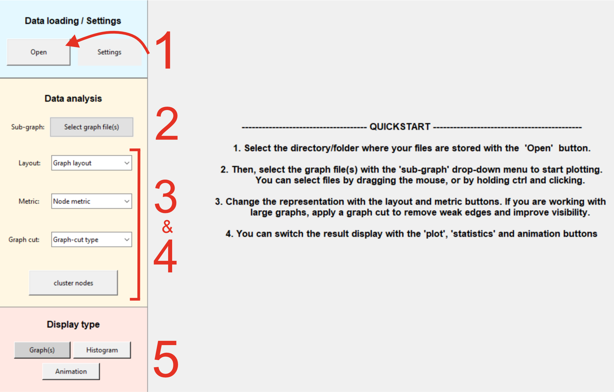

# TempGraphViz
An interactive GUI designed for exploring, analyzing, and visualizing **temporal graphs**.

---
## Installation
TempGraphViz is part of the Python Package Index and can be installed via ```pip install tempgraphviz```.

To start the GUI, simply run ```python tempgraphviz.main_gui```
If you do not have Python installed, or are not familiar with it, you can download tempgraphviz as an excucutable file [here](link).
---

## Quickstart
Your data should be stored in a single folder, as **.csv files**. Each .csv file representing a graph at a given time point of the analysis.
Run ```python tempgraphviz.main_gui``` or open the excutable. Then:

1. Click **Open** to select the folder containing your `.csv` graph files.  
2. Use the **Sub-graph selector** to choose one or multiple graph layers to visualize/analyse.  
3. Adjust the **layout** and **metrics** to explore structural properties.  
4. Optionally apply a **graph cut** for better readability on large graphs.  
5. Switch between **Graph**, **Histogram**, and **Animation** views for different insights.



---
## Main Functionalities

### Structure visualization
Once you have selected the input files to be visualized, the default view will be a 3D stack that lets you see how connections evolve as a function of time.
You can also compute various [metrics](metrics.md) that quantify the importance of the nodes in the graph. More important nodes will be displayed larger as others.


### Metrics distribution


### Graph animation


---

## Example on real data


---

