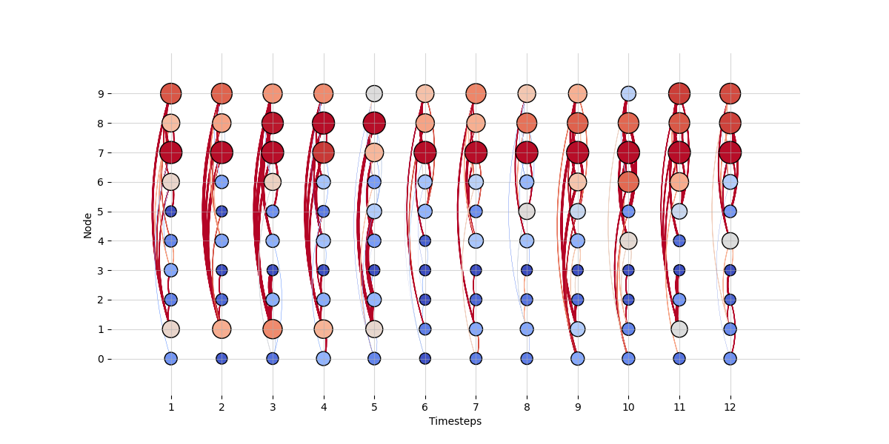

# Summary
Temporal network analysis is an emerging and rapidly growing research area concerned with studying how graphs evolve over time. 
Graphs provide a natural way to represent complex systems and have therefore become indispensable across a wide range of scientific domains, including neuroscience, biology, sociology, and natural language processing. 
While traditional network analysis has focused primarily on static structures, most real-world systems are inherently dynamic: their connectivity patterns change, sometimes subtly and sometimes dramatically, over time. 
As a result, understanding both the structural properties of a network and their temporal evolution is essential for uncovering the mechanisms that drive system behavior.

Temporal network analysis addresses this need by jointly examining topology and dynamics, enabling researchers to capture the interplay between stable structural features and transient temporal variations. 
The field is intrinsically multidisciplinary, drawing on methodologies from graph theory, dynamical systems, statistics, and machine learning. 

This methodological diversity, however, can pose significant challenges for researchers, particularly in the early stages of data exploration.
In this context, effective visualization is needed to provide an intuitive entry point into the data and to guide subsequent analytical decisions. 
To this aim, we developed TempNetViz, a tool for visualizing temporal network data, supporting early-stage exploration, and highlighting structural and temporal patterns of potential interest. 
Particular attention was given to usability, making data exploration as intuitive as possible.
TempNetViz was built using igraph and networkx, two of the most popular graph visualization packages in Python `[@csardi2006igraph; @hagberg2008exploring]`.

# Statement of need
To the best of our knowledge, there are currently no graphical user interfaces (GUIs) available that are designed specifically for the interactive visualization of temporal graphs. 
Although some established graph visualization tools provide options for displaying temporal networks `[@bastian2009gephi; @shannon2003cytoscape]`, they were not tailored for this purpose. 
Their features are limited, often relying on specialized internal data formats or external plugins. 
As a result, researchers face a substantial learning barrier that must be overcome before meaningful analysis can be conducted. Moreover, this also makes systematic comparison across different data representations difficult.

While numerous Python packages for temporal graph analysis are available `[@passos2024networkx; @thompson2021teneto; @hackl2021analysis]`, they either offer limited visualization capabilities or are more oriented towards modeling and classification. 
Leveraging the strengths of these existing dependencies also requires coding expertise, which can represent a significant obstacle for researchers lacking extensive programming experience. 
To address these limitations, we developed TempNetViz, an easy accessible and user-friendly tool for visualizing temporal graphs.

# Key features
The main advantage of TempNetViz is that it allows users to switch effortlessly between different representations of the data. Once the analysis parameters have been chosen (for details, see the [documentation](https://cnelias.github.io/TempNetVizDocs.github.io/)), results can be displayed in four complementary ways. Below, we briefly present these visualization modes and discuss their advantages and limitations.

The first mode, called multi-layer representation, displays each time step as an individual graph within a separate layer. The layers are stacked on top of each other in chronological order from bottom to top, creating a three-dimensional view (see Fig. 1). 
This view can be rotated interactively with the mouse to show different perspectives of the multi-layer graph. It is probably the most complete representation of the data, but it can become overcrowded when too many time steps are displayed at once.

{ width=50% }

The second mode displays the graph associated with each time step sequentially, producing an animation of the network's evolution. While this approach makes the structure less explicit, it provides a highly intuitive view of temporal changes. A slider is also included to give users fine-grained control over which time steps are displayed. 

The third mode is the temporal layout `@linhares2023visualisation`. In this view, nodes are are arranged along the y-axis, and edges are drawn at each time step (see Fig. 2). The ordering of the nodes along the y-axis is chosen to minimize overlap between edges and to enhance clarity. Unlike other layouts, it does not cluster strongly connected nodes, so the underlying graph structure is less evident. Instead, it emphasizes a clear depiction of global activity patterns and their evolution over time.

{ width=80% }

Finally, TempNetViz allows users to plot the values of various graph descriptors (see the metrics section in the [documentation]) as a function of time using stacked histograms. This mode discards structural information entirely, instead emphasizing how global properties evolve (see Fig. 3).

{ width=70% }

In addition to the main data representations, TempNetViz allows computation of a range of standard graph metrics to characterize the importance of nodes at each time step in the temporal network. Nodes are sized and colored according to the value of the selected metric, and both node and edge colors can be customized using different colormaps to enhance visibility. For example, in Fig. 1, nodes are colored by their strength, a metric that quantifies the sum of the weights of all edges connected to a node.

# Research application
TempNetViz was applied to explore the formation of stable cliques (so called 'rich-clubs') in mouse societies `@nelias2025stable`. The study shows that in groups of mice living in semi-naturalistic environments, highly social and stable cliques tend to emerge. To demonstrate this, pairwise interactions between mice were extracted from long-term video recordings, and temporal networks were constructed by aggregating the total number of interactions within three-day windows. Each subgraph of the temporal network revealed the presence of rich-clubs, i.e. groups of highly interconnected nodes. Tracking their evolution over time showed that one specific clique remained part of the rich-club throughout most of the experiment and was therefore identified as a stable rich-club. Importantly, mice with impaired cortical oxytocin signaling were unable to enter such stable rich-clubs, despite maintaining overall social motivation. These findings highlight the role of oxytocin in tuning sensory systems toward a social processing state.

Figure 4 illustrates how the main finding of this article can be visualized using TempNetViz. In this example, the graph was first pruned to retain only edges between mutual nearest neighbors of 3rd order (graph-cut in TempNetViz). The nodes belonging to the rich-club were then identified (rich-club metric in TempNetViz). Nodes that were part of the rich club in at least four out of five time steps were considered members of the stable rich club. In this case, three mice were met this criterion.
{ width=50% }

# Acknowledgement
The work was funded by BMBF 3R consortium grants ‘NoSeMaze1’ (161L0277A) and ‘NoSeMaze2’ (16LW0333K) to W.K., Leibniz Association program grant ‘Learning resilience’ (K430/2021) to W.K., Boehringer Ingelheim Foundation grant ‘Complex Systems’ to W.K., BMBF CRCNS grant ‘Oxystate’ (01GQ1708) to W.K, DFG CRC 379 Project C03 to W.K., 
and the DFG Clinician Scientist Program ‘Interfaces and Interventions in Complex Chronic Conditions’ (EB187/8-1) to J.R.

# References
